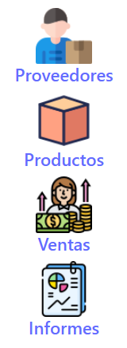

<p align="center">
  
</p>


<h1 align="center"> Pro360</h1>
<p align="center"><i>Gestión completa de proveedores, productos y ventas.</i></p>

--- 

<p align="center">
  
  
  
  
</p>


## 🧾 Overview

Pro360 is a modern web application designed for suppliers to manage their daily business operations with ease and precision.

This application allows suppliers to:

🔍 Track and manage their products, sales, and purchases.

📊 Generate reports to analyze sales performance and business trends.

🧭 Use a user-friendly interface with intuitive navigation and icon-based menus.

⚡ Rely on a robust tech stack built with React, styled with Bootstrap, and fully responsive across devices.

Whether you're a solo supplier or a growing provider network, Pro360 gives you the tools to stay organized, informed, and in control.


## 🚀 Demo

> 


## 📁 Project Structure

```plaintext
src/
├── assets/img/            # Icons and branding assets
├── pages/                 # Main views
│   ├── HomePage.jsx
│   ├── ProvidersPage.jsx
│   ├── ProductsPage.jsx
│   ├── SalesPage.jsx
│   ├── ReportsPage.jsx
│   └── ErrorPage.jsx
├── App.jsx                # App root with routing
├── NavComponent.jsx       # Navigation bar with icons
├── App.css                # Custom styles
```


## 🧠 Tech Stack

- ⚛️ **React**
- 🧭 **React Router DOM**
- 🎨 **Bootstrap 5**
- 🧰 JavaScript (ES6+)
- 🖼️ HTML5 + CSS3


## 🗺️ App Routes

| Route        | Description                      |
| ------------ | -------------------------------- |
| `/`          | Home *(currently commented out)* |
| `/providers` | Supplier Management              |
| `/products`  | Product Management               |
| `/sales`     | Sales Overview                   |
| `/reports`   | Reporting Dashboard              |
| `*`          | 404 Error Page                   |


## 📸 UI Preview (Navigation Icons)


```jsx
<Link to="/providers">
  
  <h5>Proveedores</h5>
</Link>
<Link to="/products">
  
  <h5>Productos</h5>
</Link>
<Link to="/sales">
  
  <h5>Ventas</h5>
</Link>
<Link to="/reports">
  
  <h5>Informes</h5>
</Link>
```


## 🛠️ Installation
```bash

# Clone the repository
git clone https://github.com/danielrs89/your-repo.git

# Navigate to the project folder
cd your-repo

# Install dependencies
npm install

# Run the development server
npm start
```


## 📬 Author

Made with ❤️ by Daniel

📧 dani89rosa@gmail.com
🔗 LinkedIn
🐙 GitHub


## 📢 Contribute

Pull requests and feedback are welcome!
Help improve this project by opening an issue or submitting a feature request.


## 📝 License

This project is licensed under the [MIT License]().
